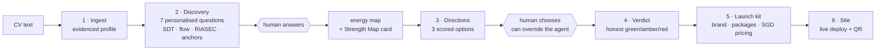
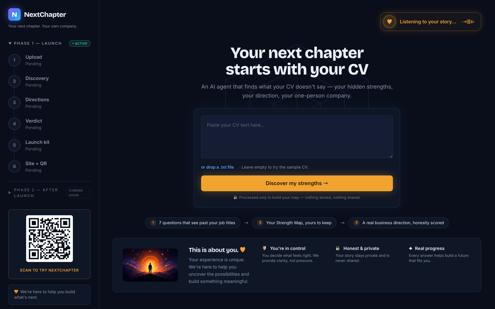
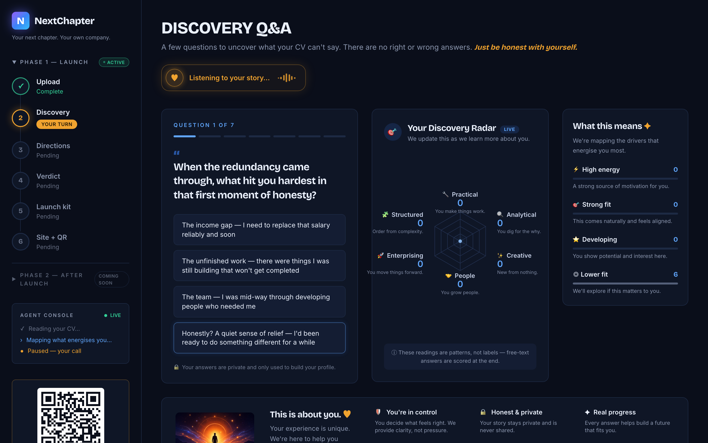
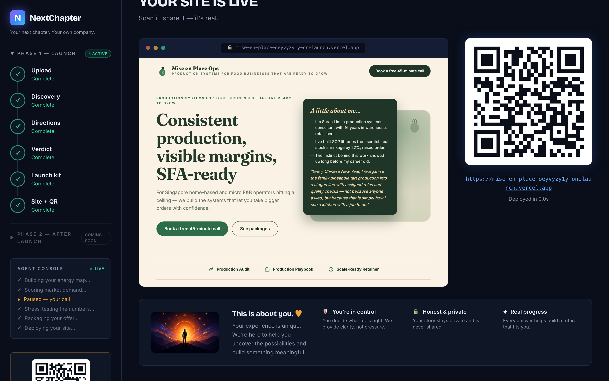

# NextChapter

**Your next chapter starts with your CV.**

Every year, thousands of experienced PMETs in Singapore are retrenched mid-career —
people with 15+ years of real capability whose CVs describe the jobs they held, not
the person they are. NextChapter is an AI agent that reads a CV, then asks the seven
questions the CV can't answer, and finds what's hidden: the strengths that show up in
someone's life before they ever show up on a payslip. Sarah, our demo persona, ran a
warehouse for 16 years — and reorganises her family's Chinese New Year pineapple-tart
baking into a staged production line with quality gates, because that's simply how she
sees a kitchen. Her CV never mentions it. NextChapter finds it, and builds a company on it.

From one pasted CV, the agent runs a six-stage pipeline: extract the evidenced profile →
a psychology-grounded discovery interview → three scored business directions (**the human
chooses — the agent's recommendation can be overridden, and that's the point**) → an
honest green/amber/red viability verdict that is allowed to say "not yet" → a full launch
kit (brand, packages, SGD pricing, first-client email) → a real website, deployed live
with a QR code. CV in, company out, human judgment in between.

---

## Architecture



Design decisions that matter:

- **Cache-first, offline-replayable.** Every stage is a pure function (JSON in →
  schema-validated JSON out) cached by SHA256 of its input. The full demo path replays
  byte-identically with the network hard-blocked — zero external requests attempted.
- **Session-scoped state.** Every browser session gets its own pipeline state, living
  profile, and decision journal; the cache is shared by input hash (same CV → same
  result is correctness, not leakage). Verified with concurrent interleaved runs.
- **Psychology-grounded discovery.** Question generation is informed by
  Self-Determination Theory, flow research, Holland's RIASEC interests, and Schein's
  career anchors — no validated instrument administered, but every question targets one
  construct and every option maps to signals. Energy drains act as vetoes downstream.
- **The honesty engine.** Viability verdicts are allowed to be negative (both demo
  personas score **amber**, with the revenue arithmetic shown). The agent's direction
  recommendation is honest scoring, not flattery — in the demo, the human overrides it.
- **Human judgment is a feature, not a UX gap.** The pipeline pauses twice for the
  human: the discovery answers and the direction choice. The theme of the build.

## Stack

FastAPI (Python 3.11, stdlib sqlite3, no ORM) · React + Vite + Tailwind + Recharts ·
Claude Sonnet 4.6 (per-stage temperatures, typed I/O via pydantic) · Vercel REST API
for generated-site deploys · ngrok static domain for the public tier.

## Screenshots

| Landing | Discovery | Finale |
|---|---|---|
|  |  |  |

## Live

- **App (public lite tier, live during the event):** https://designer-unfiled-service.ngrok-free.dev
- **Sarah's generated company, deployed by the agent:** https://mise-en-place-oeyvyzy1y-onelaunch.vercel.app

## Run locally

```bash
python3 -m venv .venv && .venv/bin/pip install -r requirements.txt
cp .env.example .env   # add ANTHROPIC_API_KEY and VERCEL_TOKEN
cd frontend && npm install && npm run build && cd ..
.venv/bin/uvicorn backend.app:app --port 8000   # serves app + API on one port
# open http://localhost:8000
```

Every stage also runs standalone, e.g. `python -m backend.stages.ingest fixtures/cv.txt`.
Demo-day operations: see [demo/RUNBOOK.md](demo/RUNBOOK.md).

## Status

Solo build for **BUIDL_QUESTS 2026 OPC Hackathon (Track 05)**, built July 10–12 with
Claude Code — one golden path deep; public lite tier live. Phase 2 (Market Campaign,
Leads Engine, CFO Module, CEO Copilot) is roadmap.

Built by **Sheryl Deng**.
